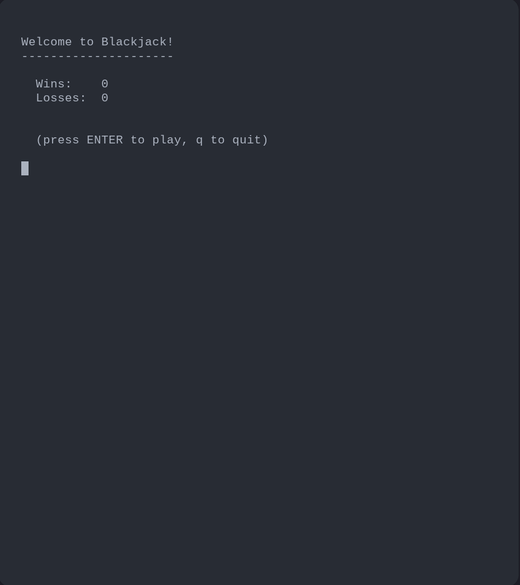
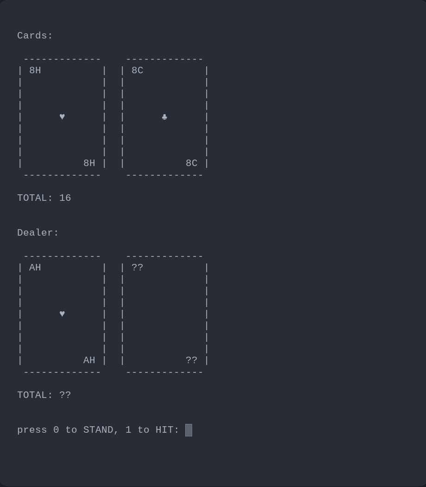
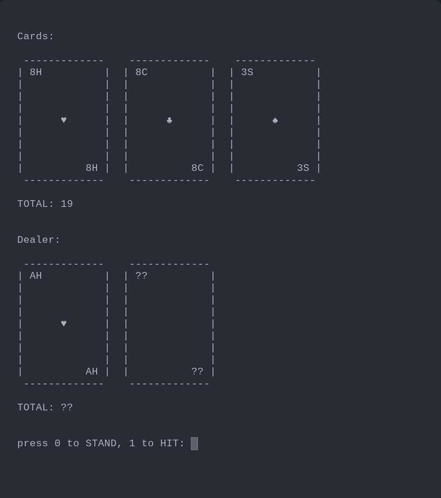
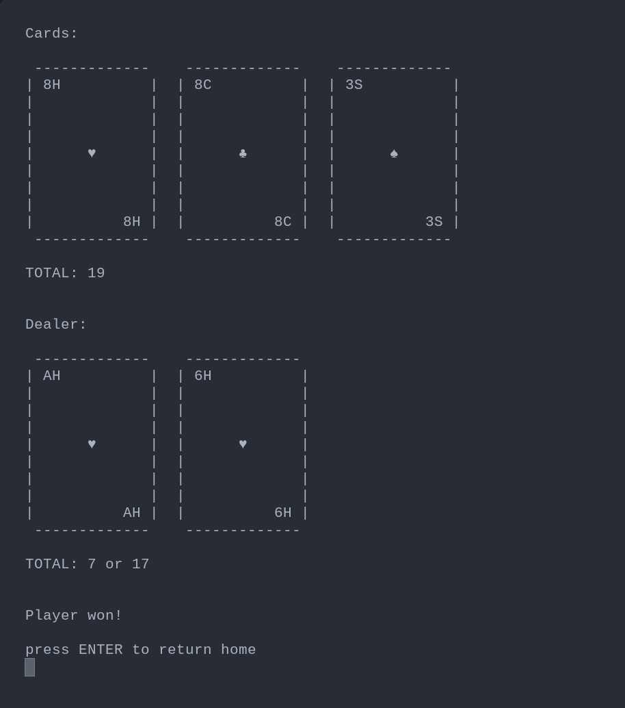

# Blackjack

A terminal based Blackjack app written in Python

The Blackjack project is a simple game designed to test my object-oriented programming skills
in Python. All project libraries are written by me.

* **clilib (Command Line Interface Library)** provides a library for simple
  TUI applications. The multiappend method enables the Display class to render
  text objects vertically and horizontally
* **pokerlib** contains the Deck, Card, and Player classes which are extended
  by the **blackjacklib**
* **blackjacklib** contains various classes and methods including a UI class
  which extends the Display class provided by **clilib**
* **Blackjack.py** is the main program which depends on the **blackjacklib**.
  
 
<h4 align="center">Preview</h4>

    
    

    
    

